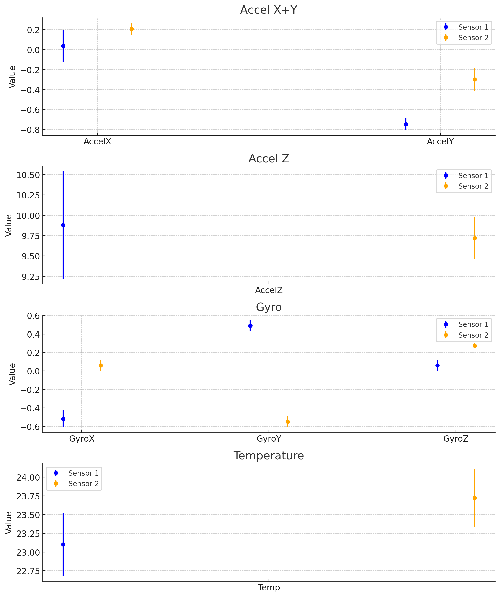

# Calibration data

Get values from log outputs with this regex: <https://regex101.com/r/xvMECp/2>

```regex
\[..:..:..]\[D]\[bmi160:243]: Got accel={x=([\-\.\d]+) m\/s², y=([\-\.\d]+) m\/s², z=([\-\.\d]+) m\/s²}, gyro={x=([\-\.\d]+) °\/s, y=([\-\.\d]+) °\/s, z=([\-\.\d]+) °\/s}. temp=([\-\.\d]+)°C
```

## Getting calibration data

1. Flash the ESPHome code, ensuring you have the correct logging options:

   ```yaml
   logger:
     level: DEBUG
     logs:
       sensor: INFO
   ```

2. Place the accelerometers on a flat surface. Ensure the ESP32 has a constant Wi-Fi connection to prevent it from restarting
3. Stream the ESPHome logs to a file: `esphome logs accelerometers.yaml --device /dev/ttyUSB0 > data.txt`
4. Leave it for a couple of hours or whatever to get some good averages
5. Calculate averages from the logs using the Python script: `python calibration_data/averages_from_log.py data.txt`
6. Calculate local acceleration due to gravity: <https://www.sensorsone.com/local-gravity-calculator/>
7. Update the relevant `offset` filter values in `accelerometers.yaml`, remembering the following:
   - Sensor 1 from the Python script may correspond to the second accelerometer in the YAML file, and vice versa (cross-check the averages with current sensor outputs to see which is which)
   - Negate the average value to get the offset (e.g. an average of `0.206` becomes `offset: -0.206`)
   - For accelerations in the Z axis, calculate (average_acceleration - local_gravity) first, and then negate that value

### Checking that the sensor values are separate

Generate a plot like the following from the **ranges** section of the Python script output:



Look for the values where the readings from the two sensors do not overlap, e.g. AccelY in the plot above. This shows that the script has correctly separated the readings from the two sensors. If _all_ values (acceleration, gyro, temperature) overlap, then it's possible that the script has jumbled the sensors up, so the averages will not be reliable.

In the future, the script should probably automatically do this check numerically.
